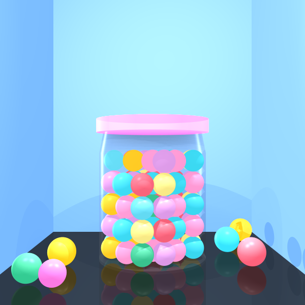
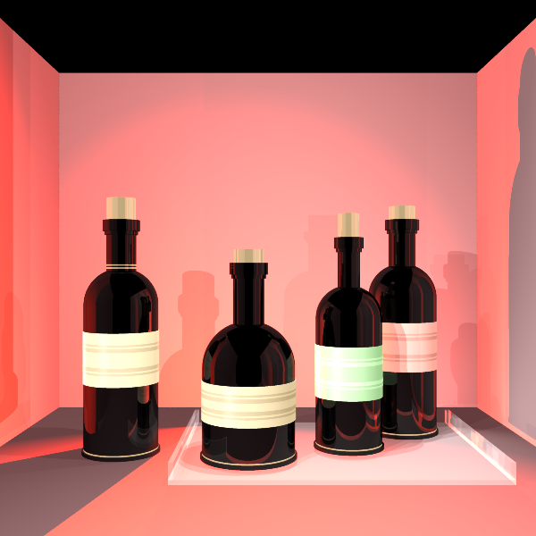
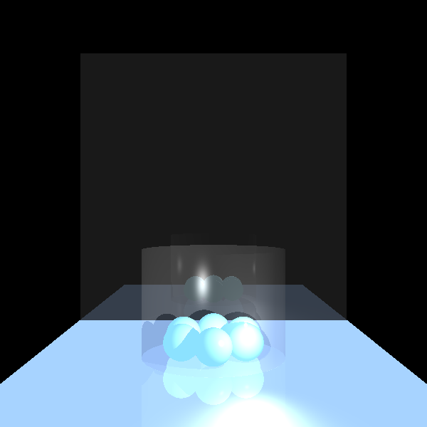
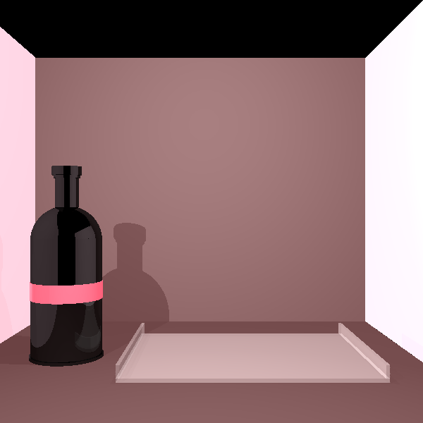
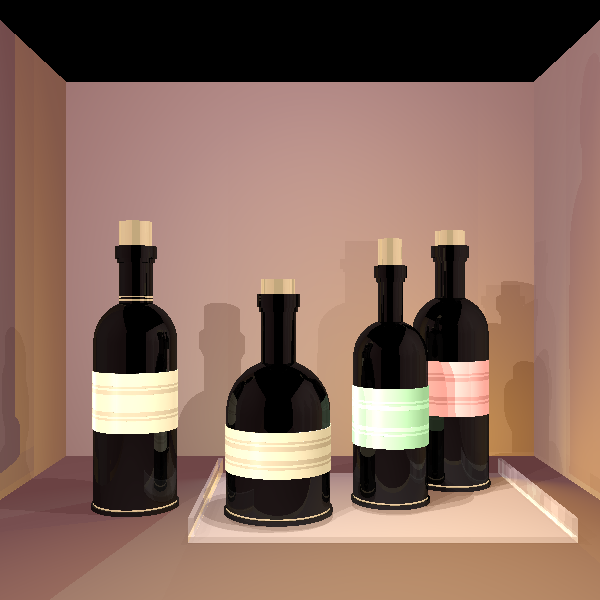

#  Ray Tracing Engine

<div align="center">


</div>

---

## About The Project

A **3D Ray Tracing Engine** built from scratch in **Java** as part of the Software Engineering course. The project demonstrates creating three-dimensional graphics with realistic physical phenomena including light sources, ray casting, reflection, refraction, color interaction, and shadow rendering.

**Key Features:**
- Complete ray tracing implementation for photorealistic 3D rendering
- Physical light simulation (reflection, refraction, shadows)
- Multiple geometric primitives (spheres, triangles, planes, cylinders)
- Anti-aliasing for smooth, professional edges
- Custom Java libraries with no external graphics dependencies

---

## Technology Stack

- **Language:** Java
- **IDE:** IntelliJ IDEA
- **Development:** TDD (Test-Driven Development) with Refactoring
- **Methodology:** Agile development principles
- **Graphics:** Custom ray tracing algorithms
- **Testing:** Comprehensive unit testing

---

## Project Structure

```
src/
├── geometries/          # 3D geometric shapes and intersection algorithms
├── lighting/            # Light sources and material properties
├── primitives/          # Mathematical foundations (vectors, points, rays)
├── renderer/            # Core rendering engine and camera
└── elements/            # Scene composition utilities

images/                  # Rendered output demonstrations
unittests/              # TDD unit test coverage
```

---

## Development Process

**TDD Implementation:**
- Test-driven development ensuring robust geometric calculations
- Comprehensive unit testing for all mathematical operations
- Continuous refactoring for clean, maintainable code

**Agile Methodology:**
- Iterative development with incremental feature additions
- Regular testing and validation of rendering improvements
- Collaborative development practices

---

## Featured Demonstrations

### Gum Jar Scene Evolution

**Initial Setup**  


**Complete Rendering**  


**Anti-Aliased Final Result**  


### Wine Bottle Scene

**Basic Scene**  


**With Glass Tray**  


**Final Rendering**  


---

## Technical Highlights

**Ray Tracing Engine:**
- Custom intersection algorithms for all geometric shapes
- Advanced lighting calculations with multiple light sources
- Realistic shadow casting and reflection effects
- Physics-based material interactions

**Mathematical Implementation:**
- 3D coordinate system with precise transformations
- Vector mathematics for ray calculations
- Surface normal computations for accurate lighting
- Edge case handling for geometric stability

**Quality Enhancements:**
- Anti-aliasing algorithms for smooth edges
- Transparency and refraction effects
- Material properties (shininess, reflectivity)
- Optimized rendering performance

---

## Key Achievements

- **From-Scratch Development:** Complete 3D engine without external graphics libraries
- **Mathematical Precision:** Accurate implementation of 3D graphics algorithms
- **Physical Realism:** Proper simulation of light behavior and material interaction
- **Professional Quality:** Photorealistic rendering with advanced anti-aliasing
- **Clean Architecture:** Well-structured, maintainable codebase following TDD principles

---

## Course Integration

This project was developed as part of the **Software Engineering Course (ISE5783)**, demonstrating:
- Large-scale Java project architecture
- Test-driven development practices
- Agile development methodologies
- Advanced mathematical problem-solving
- Computer graphics programming fundamentals

The implementation showcases the ability to build complex systems from mathematical foundations while maintaining clean code practices and comprehensive testing coverage.
